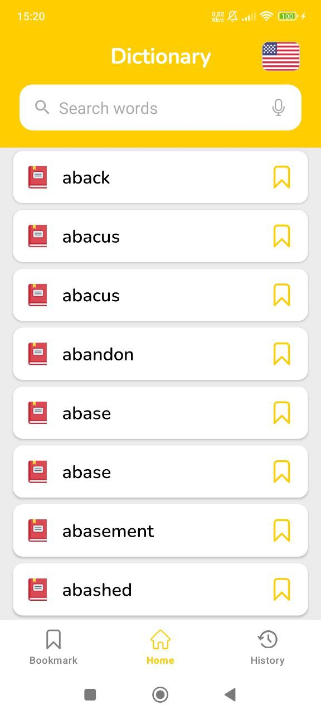
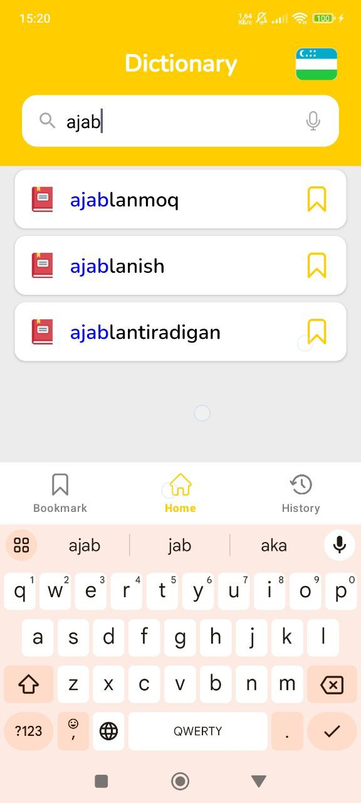
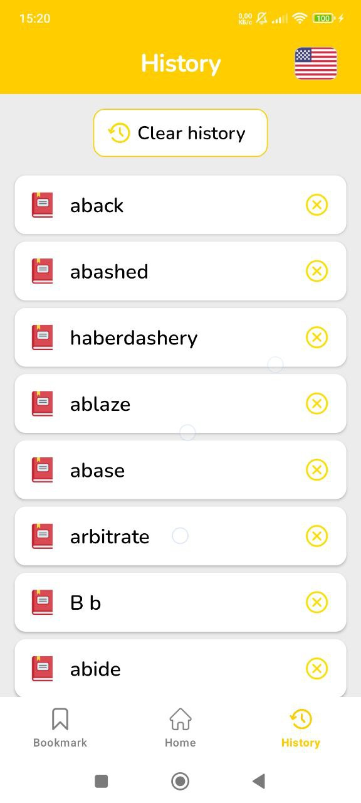
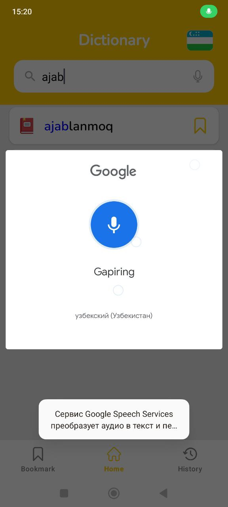
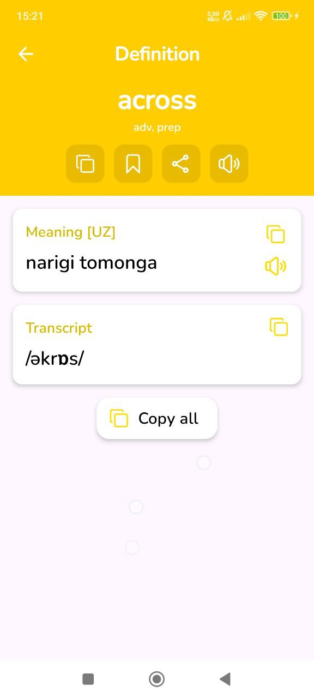
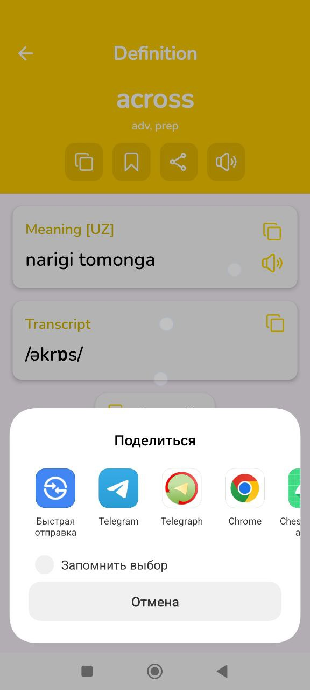

# Dictionary - English & Uzbek App

Welcome to the **Dictionary App** repository! This is a native **Android** application for translating words between **English** and **Uzbek**. It also includes **history** and **favourites** features, allowing users to save and revisit their search terms. The app is built using **Android Native**, following **Clean Architecture**, **MVP** pattern, and incorporating several powerful features like **Text-to-Speech (TTS)**, **Room Database**, and **BottomNavigation**.

---

### 📱 **App Overview**

The **Dictionary App** provides English-Uzbek translation with features for saving your search history and favourite words. With a simple, user-friendly interface, users can easily navigate between the dictionary, history, and favourites sections using **BottomNavigation**.

The app uses **Room Database** to store data locally, allowing for quick access to history and favourites. The app also supports **Text-to-Speech (TTS)** for pronunciation, and **ShareText** functionality for sharing word translations.

---

### 🚀 **Features**

- **English $ Uzbek Dictionary**: Provides translations between English and Uzbek.
- **History**: Keeps track of recent translations for easy access.
- **Favourites**: Allows users to save their favourite translations for quick reference.
- **Text-to-Speech (TTS)**: Listen to the pronunciation of words in both English and Uzbek.
- **ShareText**: Share translated words with others via various apps.
- **BottomNavigation**: Easily switch between dictionary, history, and favourites sections.
- **Room Database**: Stores history and favourites locally for quick and offline access.
- **MVP Architecture**: Follows the **Model-View-Presenter (MVP)** pattern for better separation of concerns.
- **Dialogs**: Custom dialogs to interact with users (e.g., confirmation or error messages).
- **SharedPreferences**: Used for saving user preferences and settings.

---

### ⚙️ **Technologies Used**

- **Android Native**: Developed with the Android SDK and Kotlin.
- **Clean Architecture**: Uses **Room Database** for local data storage and proper separation of concerns.
- **MVP Pattern**: Ensures the app is modular, testable, and easy to maintain.
- **Room Database**: Stores data for history and favourites.
- **Text-to-Speech (TTS)**: Pronounces words in both English and Uzbek.
- **BottomNavigation**: Allows easy navigation between different sections of the app.
- **RecyclerView**: Efficiently displays lists of words, history, and favourite items.
- **SharedPreferences**: For saving user settings and preferences (e.g., TTS language).
- **Dialogs**: Custom dialogs for user interactions like confirmations and warnings.
- **ShareText**: Allows users to share words with others directly from the app.

<table>
  <tr>
    <td></td>
    <td></td>
  </tr>
  <tr>
    <td></td>
    <td></td>
  </tr>
  <tr>
    <td></td>
    <td></td>

</table>
